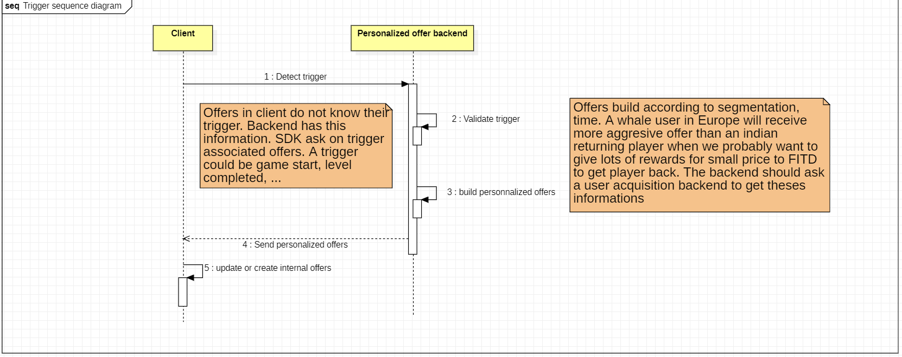
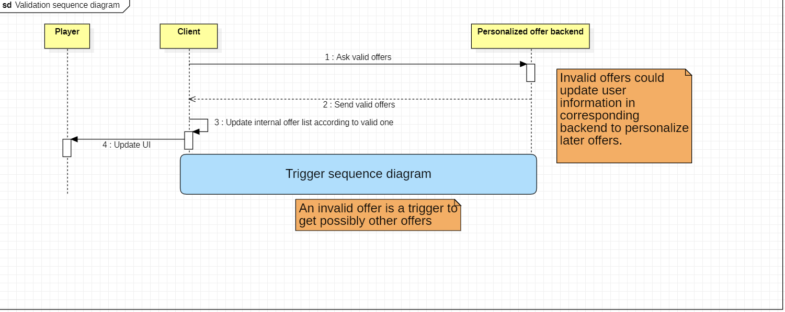

# Personalized Offer System for a Mobile Game SDK

## Introduction
This project aims to design a personalized offer system for a mobile game SDK. The system allows server-side configuration of offers, including rewards, prices, triggers, validation conditions, and user segmentation. The system must also be extensible to support additional features such as multiple offers, chained offers, and endless offers.

## Problem Statement
The main challenge is to create a scalable and modular system that clearly separates responsibilities between the client (Unity) and the server. The system must handle dynamic offers, validate complex conditions, and adapt to new types of offers and triggers with minimal changes.
---

## Personal Brief Note

The primary goal for me was to make most of the logic server-side to ensure **scalability** and **security**. I aimed to create a package that is "clef en main" (ready-to-use) for other developers, allowing them to easily integrate it into their games. I tried to make the SDK as **engine-agnostic** as possible (well, Unity-agnostic in our case), except for the SDK entry point and the use of `UnityWebRequest` (which can be replaced with `HttpClient` in another implementation) in the service.

I know I spent some time trying to imagine all possible backend services (like purchase, user acquisition, authentication) and eventually removed my initial diagrams to focus solely on **personalized offers** in multiple diagrams (with notes to replace the older, more complex diagrams). Oh, and I also spent time on Postman documentation and Markdown files because I wanted a clean `README` (which should probably be divided into multiple files with links—sorry!). But I'm not sure if that was really a waste of time.

Regarding **additional features**, I think more **client-side caching** would be interesting to create a more robust fallback system. A **push notification system** could also be added, with specific endpoints to fetch future personalized offers for the player. Additionally, **battle pass personalized offers** could be a great way to attract new players, and **multi-game personalized offers** (e.g., buy an offer to unlock unique items in another Voodoo game) could add a new layer of engagement.

---


## Sequence Diagrams for interaction between client and server

### Trigger Sequence Diagram


### Offers validation Sequence Diagram


### Offers validation Sequence Diagram


--- 

## API Endpoint Definitions

## Summary

| Endpoint                | HTTP Verb | Route                      | Description                                      |
|-------------------------|----------|----------------------------|--------------------------------------------------|
| GetTriggeredOffers      | GET      | /api/offers/triggered      | Fetches a list of offers triggered for a specific player based on a trigger type.        |
| ValidatePurchasedOffer  | POST     | /api/offers/validatePurchase       | Validates whether a specific offer has been successfully purchased by a player.                   |
| CancelledOffer         | POST     | /api/offers/cancel         | Indicate that a user saw an offer without buying it.|
| GetValidOffers         | GET      | /api/offers/valid         | Fetches a list of valid offer UUIDs for a specific player.       |


### 1. GetTriggeredOffers

#### Description:
Fetches a list of offers triggered for a specific player based on a trigger type.

### Endpoint:
- **HTTP Verb**: `GET`
- **Route**: `/api/offers/triggered`
- **Headers**:
  - `Content-Type: application/json`
  - `Authorization: Bearer <token>`

### Request Payload:
```json
{
    "playerUuid": "123e4567-e89b-12d3-a456-426614174000",
    "triggerType": "SessionStarted"
}
```

### Response Payload:
```json
[
        {
        "uuid": "123e4567-e89b-12d3-a456-426614174001",
        "rewards": [
            { "rewardType": "SoftCurrency", "amount": 100 }
        ],
        "condition" : [
            {"conditionType" : "TimeLeft", "value" : "86400"}
        ],
        "startTime": "2023-10-01T12:00:00Z",
        "linkedOffersUid" : [
            "123e4567-e89b-12d3-a456-426614174001"
        ]
    },
    {
        "uuid": "123e4567-e89b-12d3-a456-426614174001",
        "rewards": [
            { "rewardType": "SoftCurrency", "amount": 200 },
            { "rewardType": "Energy", "amount": 20 },
        ],
        "price": {
            "currency": "EUR",
            "amount": 5.99,
            "discount" : {
                "percent": 10
            }
        },
        "condition" : [
            {"conditionType" : "LevelSucceed", "value" : "12"}
        ],
        "startTime": "2023-10-01T12:00:00Z",
    },
]
```

### 2. ValidatePurchasedOffer

#### Description:
Validates whether a specific offer has been successfully purchased by a player.

#### Endpoint:
- **HTTP Verb**: `POST`
- **Route**: `/api/offers/validatePurchase`
- **Headers**:
  - `Content-Type: application/json`
  - `Authorization: Bearer <token>`

#### Request Payload:
```json
{
    "playerUuid": "123e4567-e89b-12d3-a456-426614174000",
    "offerUuid": "123e4567-e89b-12d3-a456-426614174001"
}
```

#### Response Payload:
```json
{
      "success": true,
}
```

### 3. CancelledOffer

#### Description:
Indicate that a user saw an offer without buying it.

#### Endpoint:
- **HTTP Verb**: `POST`
- **Route**: `/api/offers/cancel`
- **Headers**:
  - `Content-Type: application/json`
  - `Authorization: Bearer <token>`

#### Request Payload:
```json
{
    "playerUuid": "123e4567-e89b-12d3-a456-426614174000",
    "offerUuid": "123e4567-e89b-12d3-a456-426614174001"
}
```

#### Response Payload:
```json
{
      "success": true,
}
```

### 4. GetValidOffers

#### Description:
Fetches a list of valid offer UUIDs for a specific player.

#### Endpoint:
- **HTTP Verb**: `GET`
- **Route**: `/api/offers/valid`
- **Headers**:
  - `Content-Type: application/json`
  - `Authorization: Bearer <token>`

#### Request Payload:
```json
{
    "playerUuid": "123e4567-e89b-12d3-a456-426614174000"
}
```

#### Response Payload:
```json
[
    "123e4567-e89b-12d3-a456-426614174001",
    "123e4567-e89b-12d3-a456-426614174002"
]
```

## Edge Cases and Mitigation Strategies

#### Summary of Edge Cases and Mitigation Strategies

| **Edge Case**                     | **Mitigation Strategies**                                                                 |
|------------------------------------|------------------------------------------------------------------------------------------|
| Backend Unavailable                | Client-side caching, retry mechanism, fallback offers.                                   |
| Invalid JSON Response              | Server-side validation, JSON schema validation, fallback offers.                 |
| User Tries to Purchase Invalid Offer | Pre-purchase validation, client-side checks, user feedback.                              |
| Sanity Check Overloads the System  | Throttling, client-side optimization.                                  |
| Network Latency or Timeouts        | Timeout handling, fallback offers.                                 |


### 1. Backend Unavailable
### Scenario:
The server is down or unreachable, and the client cannot fetch or validate offers.

### Mitigation Strategies:
- **Client-Side Caching**:
  - Cache offers locally on the client so that the game can still display offers even if the server is unavailable.
  - Use a timestamp to invalidate cached offers after a certain period.

- **Retry Mechanism**:
  - Implement an exponential backoff retry mechanism in Unity to periodically attempt to reconnect to the server.

- **Fallback Offers**:
  - Provide a set of default offers that can be displayed if the server is unavailable.

---

## 2. Invalid JSON Response
### Scenario:
The server sends malformed or invalid JSON data, causing the client to fail when parsing the response.

### Mitigation Strategies:
- **Server-Side Validation**:
  - Ensure the server validates all responses before sending them to the client.

- **Schema Validation**:
  - Use a JSON schema validator on the client to ensure the response matches the expected structure.

- **Fallback Offers**:
  - Provide a set of default offers that can be displayed if the server is unavailable.

---

## 3. User Tries to Purchase an Invalid Offer
### Scenario:
The user attempts to purchase an offer that is no longer valid (for instance offer expired or already purchased).

### Mitigation Strategies:
- **Pre-Purchase Validation**:
  - Validate the offer on the server before processing the purchase.

- **Client-Side Checks**:
  - Check the offer’s `cachedState` (e.g., `isBought`, `isConditionMet`) before allowing the user to initiate a purchase.

- **User Feedback**:
  - Display a clear error message to the user (e.g., "This offer is no longer available.").
  - Trigger immediatly a new offer to show to player to make him continue his purchase

---

## 4. Sanity Check Overloads the System
### Scenario:
The periodic validation offers sanity check overloads the server or client.

### Mitigation Strategies:
- **Throttling**:
  - Limit the frequency of sanity checks (e.g., once every 5 minutes).

- **Client-Side Optimization**:
  - Only validate offers that are currently visible to the user (in popup or vignette in game main hub)

---

## 5. Network Latency or Timeouts
### Scenario:
Network latency or timeouts cause delays or failures in fetching or validating offers.

### Mitigation Strategies:
  - **Timeout Handling**:
    - Set a reasonable timeout for API requests (something like 10 seconds) and handle timeouts gracefully in Unity.

  
  - **Fallback Offers**:
    - Provide a set of default offers that can be displayed if the server is to slow.

---


# Mock Server Validation Strategies

To validate the personalized offer system without relying on actual server endpoints, we propose the following three strategies in order of preference:

---

## 1. Unit Tests with Mock Responses directly in Unity
### Description:
Use **unit tests** within Unity to simulate server responses. This approach is fully embedded in Unity and can be automated using **GitHub Actions**.

### Detailed Approach:
1. **Mock Server Responses**:
   - Create mock JSON responses for each API endpoint
   - Store these responses as static files or hardcoded strings in Unity.

2. **Unit Tests**:
   - Write unit tests using Unity’s **Test Framework**.
   - Use `UnityWebRequest` or a custom HTTP client to simulate API calls and return mock responses.

3. **Automation with GitHub Actions**:
   - Set up a GitHub Actions workflow to run the unit tests automatically on every push or pull request.
   - Example workflow:
     ```yaml
     name: Unity Tests
     on: [push, pull_request]
     jobs:
       test:
         runs-on: ubuntu-latest
         steps:
           - uses: actions/checkout@v2
           - name: Set up Unity
             uses: game-ci/unity-setup@v2
             with:
               unity-version: 6000.0.27f1
           - name: Run Tests
             uses: game-ci/unity-test-runner@v2
             with:
               test-mode: all 
     ```
          
4. **Testing Techniques**:
   - Test valid and invalid responses for each endpoint.
   - Simulate edge cases from "Edge Cases and Mitigation Strategies" section

### Comments:
- **Pros**:
  - Fully integrated into Unity.
  - Easy to automate with GitHub Actions.
  - No external dependencies.
- **Cons**:
  - Requires writing and maintaining mock responses.
  - Limited to testing client-side logic.

---

## 2. Small Node.js Server with Vite-Express
### Description:
Set up a lightweight **Node.js server** using **Vite-Express** to simulate server endpoints. This approach provides more flexibility than unit tests and can be run locally or in a CI/CD pipeline.

### Detailed Approach:
1. **Set Up Node.js Server**:
   - Install Node.js and create a new project:
     ```bash
     npm init -y
     npm install express vite-express
     ```
   - Create a `server.js` file with mock endpoints:
     ```javascript
     const express = require('express');
     const ViteExpress = require('vite-express');

     const app = express();
     app.use(express.json());

     app.post('/api/offers/triggered', (req, res) => {
       res.json([
         {
           offerUuid: '123e4567-e89b-12d3-a456-426614174001',
           rewards: [{ type: 'COINS', amount: 100 }],
           price: { currency: 'HARD_CURRENCY', amount: 5.99, isOnSale: false },
           conditions: [{ type: 'LEVEL_PASSED', value: 10 }],
           cachedState: { isConditionMet: true, isBought: false, offerStartTime: '2023-10-01T12:00:00Z' },
         },
       ]);
     });

     ViteExpress.listen(app, 3000, () => console.log('Mock server running on http://localhost:3000'));
     ```

2. **Run the Server**:
   - Start the server:
     ```bash
     node server.js
     ```

3. **Test in Unity**:
   - Point Unity’s API calls to `http://localhost:3000`.
   - Test all endpoints and validate the responses.

4. **Testing Techniques**:
   - Simulate different server responses like success, failure or edge cases.

### Comments:
- **Pros**:
  - More flexible than unit tests.
  - Can simulate real-world server behavior.
  - Easy to set up and run locally.
- **Cons**:
  - Requires additional setup (Node.js, Vite-Express).
  - Not fully integrated into Unity.

---

## 3. Postman Mock Server
### Description:
Use **Postman** to create a mock server and simulate API responses. This approach is quick to set up but requires familiarity with Postman.
I've never used myself contrary to the 2 other but I know it exists.
[Documentation here](https://learning.postman.com/docs/designing-and-developing-your-api/mocking-data/setting-up-mock/)

### Detailed Approach:

1. **Create a Postman Collection**:
   - Define all API endpoints in a new collection
   - Add mock responses for each endpoint.
   - Use Postman’s **Mock Server** feature to host the collection.
   - Postman will generate a public URL for the mock server.

2. **Test in Unity**:
   - Point Unity’s API calls to the Postman mock server URL.
   - Validate the responses in Unity.

3. **Testing Techniques**:
   - Simulate different scenarios by updating the mock responses in Postman.

### Comments:
- **Pros**:
  - Quick and easy to set up.
  - No coding required.
  - Can be shared with the team.
- **Cons**:
  - Requires a Postman account.
  - Limited control over server behavior.
  - Not integrated into Unity or CI/CD pipelines.

---

### My preferences
1. **Start with Unit Tests**:
   - Ideal for initial validation and integration with Unity.
   - Easy to automate with GitHub Actions.

2. **Use a Node.js Server for Advanced Testing**:
   - Provides more flexibility and simulates real-world scenarios.

3. **Use Postman for Quick Prototyping**:
   - Useful for quick validation or sharing with non-technical team members (and if you know how to use it).

---