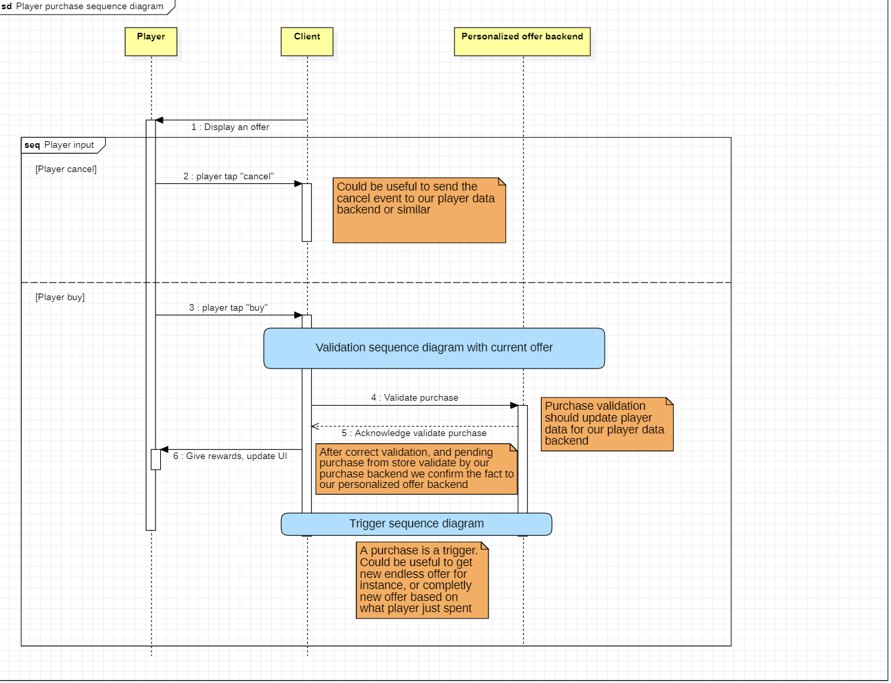

# Personalized Offer System for a Mobile Game SDK

## Introduction
This project aims to design a personalized offer system for a mobile game SDK. The system allows server-side configuration of offers, including rewards, prices, triggers, validation conditions, and user segmentation. The system must also be extensible to support additional features such as multiple offers, chained offers, and endless offers.

### Problem Statement
The main challenge is to create a scalable and modular system that clearly separates responsibilities between the client (Unity) and the server. The system must handle dynamic offers, validate complex conditions, and adapt to new types of offers and triggers with minimal changes.

---

## Sequence Diagrams for interaction between client and server

### Trigger Sequence Diagram


### Offers validation Sequence Diagram


### Offers validation Sequence Diagram


--- 

## API Endpoint Definitions

## Summary

| Endpoint                | HTTP Verb | Route                      | Description                                      |
|-------------------------|----------|----------------------------|--------------------------------------------------|
| GetTriggeredOffers      | GET      | /api/offers/triggered      | Fetches a list of offers triggered for a specific player based on a trigger type.        |
| ValidatePurchasedOffer  | POST     | /api/offers/validatePurchase       | Validates whether a specific offer has been successfully purchased by a player.                   |
| CancelledOffer         | POST     | /api/offers/cancel         | Indicate that a user saw an offer without buying it.|
| GetValidOffers         | GET      | /api/offers/valid         | Fetches a list of valid offer UUIDs for a specific player.       |


### 1. GetTriggeredOffers

#### Description:
Fetches a list of offers triggered for a specific player based on a trigger type.

### Endpoint:
- **HTTP Verb**: `GET`
- **Route**: `/api/offers/triggered`
- **Headers**:
  - `Content-Type: application/json`
  - `Authorization: Bearer <token>`

### Request Payload:
```json
{
    "playerUuid": "123e4567-e89b-12d3-a456-426614174000",
    "triggerType": "SessionStarted"
}
```

### Response Payload:
```json
[
        {
        "uuid": "123e4567-e89b-12d3-a456-426614174001",
        "rewards": [
            { "rewardType": "SoftCurrency", "amount": 100 }
        ],
        "condition" : [
            {"conditionType" : "TimeLeft", "value" : "86400"}
        ],
        "startTime": "2023-10-01T12:00:00Z",
        "linkedOffersUid" : [
            "123e4567-e89b-12d3-a456-426614174001"
        ]
    },
    {
        "uuid": "123e4567-e89b-12d3-a456-426614174001",
        "rewards": [
            { "rewardType": "SoftCurrency", "amount": 200 },
            { "rewardType": "Energy", "amount": 20 },
        ],
        "price": {
            "currency": "EUR",
            "amount": 5.99,
            "discount" : {
                "percent": 10
            }
        },
        "condition" : [
            {"conditionType" : "LevelSucceed", "value" : "12"}
        ],
        "startTime": "2023-10-01T12:00:00Z",
    },
]
```

### 2. ValidatePurchasedOffer

#### Description:
Validates whether a specific offer has been successfully purchased by a player.

#### Endpoint:
- **HTTP Verb**: `POST`
- **Route**: `/api/offers/validatePurchase`
- **Headers**:
  - `Content-Type: application/json`
  - `Authorization: Bearer <token>`

#### Request Payload:
```json
{
    "playerUuid": "123e4567-e89b-12d3-a456-426614174000",
    "offerUuid": "123e4567-e89b-12d3-a456-426614174001"
}
```

#### Response Payload:
```json
{
      "success": true,
}
```

### 3. CancelledOffer

#### Description:
Indicate that a user saw an offer without buying it.

#### Endpoint:
- **HTTP Verb**: `POST`
- **Route**: `/api/offers/cancel`
- **Headers**:
  - `Content-Type: application/json`
  - `Authorization: Bearer <token>`

#### Request Payload:
```json
{
    "playerUuid": "123e4567-e89b-12d3-a456-426614174000",
    "offerUuid": "123e4567-e89b-12d3-a456-426614174001"
}
```

#### Response Payload:
```json
{
      "success": true,
}
```

### 4. GetValidOffers

#### Description:
Fetches a list of valid offer UUIDs for a specific player.

#### Endpoint:
- **HTTP Verb**: `GET`
- **Route**: `/api/offers/valid`
- **Headers**:
  - `Content-Type: application/json`
  - `Authorization: Bearer <token>`

#### Request Payload:
```json
{
    "playerUuid": "123e4567-e89b-12d3-a456-426614174000"
}
```

#### Response Payload:
```json
[
    "123e4567-e89b-12d3-a456-426614174001",
    "123e4567-e89b-12d3-a456-426614174002"
]
```

## Edge Cases and Mitigation Strategies

#### Summary of Edge Cases and Mitigation Strategies

| **Edge Case**                     | **Mitigation Strategies**                                                                 |
|------------------------------------|------------------------------------------------------------------------------------------|
| Backend Unavailable                | Client-side caching, retry mechanism, fallback offers.                                   |
| Invalid JSON Response              | Server-side validation, JSON schema validation, fallback offers.                 |
| User Tries to Purchase Invalid Offer | Pre-purchase validation, client-side checks, user feedback.                              |
| Sanity Check Overloads the System  | Throttling, client-side optimization.                                  |
| Network Latency or Timeouts        | Timeout handling, fallback offers.                                 |


### 1. Backend Unavailable
### Scenario:
The server is down or unreachable, and the client cannot fetch or validate offers.

### Mitigation Strategies:
- **Client-Side Caching**:
  - Cache offers locally on the client so that the game can still display offers even if the server is unavailable.
  - Use a timestamp to invalidate cached offers after a certain period.

- **Retry Mechanism**:
  - Implement an exponential backoff retry mechanism in Unity to periodically attempt to reconnect to the server.

- **Fallback Offers**:
  - Provide a set of default offers that can be displayed if the server is unavailable.

---

## 2. Invalid JSON Response
### Scenario:
The server sends malformed or invalid JSON data, causing the client to fail when parsing the response.

### Mitigation Strategies:
- **Server-Side Validation**:
  - Ensure the server validates all responses before sending them to the client.

- **Schema Validation**:
  - Use a JSON schema validator on the client to ensure the response matches the expected structure.

- **Fallback Offers**:
  - Provide a set of default offers that can be displayed if the server is unavailable.

---

## 3. User Tries to Purchase an Invalid Offer
### Scenario:
The user attempts to purchase an offer that is no longer valid (for instance offer expired or already purchased).

### Mitigation Strategies:
- **Pre-Purchase Validation**:
  - Validate the offer on the server before processing the purchase.

- **Client-Side Checks**:
  - Check the offer’s `cachedState` (e.g., `isBought`, `isConditionMet`) before allowing the user to initiate a purchase.

- **User Feedback**:
  - Display a clear error message to the user (e.g., "This offer is no longer available.").
  - Trigger immediatly a new offer to show to player to make him continue his purchase

---

## 4. Sanity Check Overloads the System
### Scenario:
The periodic validation offers sanity check overloads the server or client.

### Mitigation Strategies:
- **Throttling**:
  - Limit the frequency of sanity checks (e.g., once every 5 minutes).

- **Client-Side Optimization**:
  - Only validate offers that are currently visible to the user (in popup or vignette in game main hub)

---

## 5. Network Latency or Timeouts
### Scenario:
Network latency or timeouts cause delays or failures in fetching or validating offers.

### Mitigation Strategies:
  - **Timeout Handling**:
    - Set a reasonable timeout for API requests (something like 10 seconds) and handle timeouts gracefully in Unity.

  
  - **Fallback Offers**:
    - Provide a set of default offers that can be displayed if the server is to slow.

---
